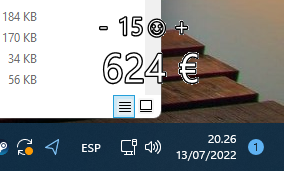

# WinMeetCost
A transparent meeting cost tracker running in the bottom right corner of the screen. It allows adding and removing attendees as the meeting continues.

Fully configurable for currency, average hourly rate and default number of attendees. 
Edit WinMeetCost.dll.config to customize it. 

Made in WinForms. Compatible with Windows and .NET 6.

